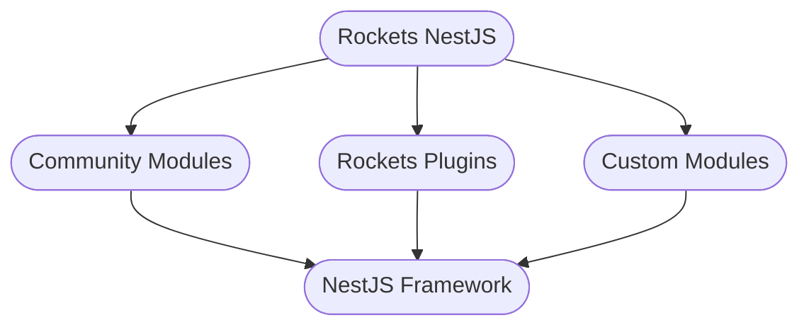
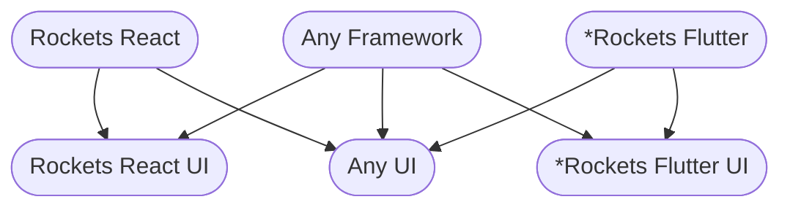

import CTA from "../components/CTA";

  

<h1>Rockets</h1>
<h3>Rapid Enterprise Development Toolkit</h3>

The Rockets API library is a collection of NestJS modules that were created for the rapid development of enterpise level APIs.

Through over 15 years of experience, we have made enterprise-level development more agile. Rockets is a combination of all these lessons, best practices and tools packaged and made available to you.

### Motivation

This project aims to help quickly build an enterprise-level core for projects that share the same business rules across web, mobile, server and desktop.

### Goals

- Provide solid stable foundational APIs to build enterprise applications.
- Focus on extensibility over customization.
- Great development experience through well thought out APIs and documentation
- Flexibility over business rules.

### Architecture

Every effort has been made to develop Rockets with an abstract mindset, and introduce as
few opinions into the code base as possible (within reason).

#### API

The Rockets API library is a collection of pluggable modules that enables you to rapidly stand up an API
for your enterprise project, and quickly extend and adapt it to your use case and requirements with _zero_ boilerplate.

- Developed with the NestJS Framework
- Dozens of pluggable open source modules
- Use with any community or custom NestJS module

#### Web & Desktop

##### React

- Abstract Logical Component Layer
- UI library developed using Material UI

##### Flutter

> \* Flutter support is on the roadmap.

- Abstract Logical Component Layer
- UI library developed using [Mix](https://www.fluttermix.com)

##### UI Compatibility

- Bring your own logical components and use one of our UI libraries
- Bring your own UI library and use our logical components
- Mix in community or custom components.

#### Mobile

We use and recommend:

- Expo
- React Native
- Flutter
